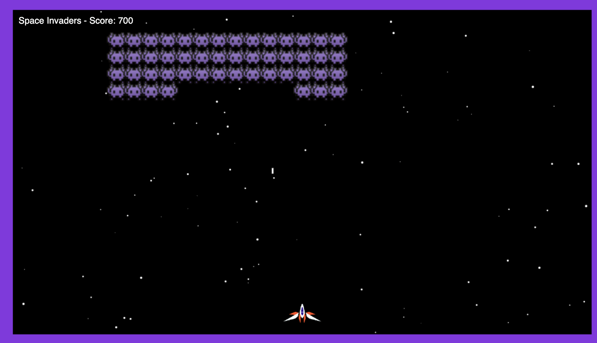

# Space Invaders Clone

## Table of contents

-   [Overview](#overview)
    -   [The challenge](#the-challenge)
    -   [Screenshot](#screenshot)
    -   [Links](#links)
    -   [Player Controls](#player-controls)
-   [The process](#the-process)
    -   [Built with](#built-with)
    -   [What was learned](#what-we-learned)
    -   [Continued development](#continued-development)
    -   [Useful resources](#useful-resources)
-   [Authors](#authors)

## Overview

### The challenge

The challenge of this game was to implement a clone of Space Invaders utilising Objects / Classes programming paradigms. It was also required to utilise HTML's <canvas></canvas> element to draw and animate the updates on screen.

Whilst the original game does not provide for vertical movement, this game does. Allows UP | DOWN movement.

### Screenshot

-   Screenshot of Space Invaders Clone
    <!--  -->

### Player Controls

-   Player 1: A (left) || D (right) || W (move up) || S (move down) || SPACE (attack)

### Links

-   Playable link: [https://mistergjones.github.io/spaceinvadersgameclone/]
-   Solution Code Frontend: [https://github.com/mistergjones/spaceinvadersgameclone]

## The process

### Built with

-   HTML & CSS for framework and structure
-   JS for game mechanics and player movement

### What was learnt

-   Primary learnings were centered upon establishing objects with associated properties and methods.
-   Instantiating the objects and invoking the methods to derive the spaceshipt movements.
-   Utilising <canvas></canvas> api to draw the required objects & images.
-   Making the spaceship stay within the boundaries of the screen.

1. The partial code taken form the Player's draw() class method demonstrates how to update the canvas's context when displaying the move left / move right functionality. Essentially, the below displays a slight "tilt" to the spaceship either left or right buttons are pressed.

```js
// 1. To enable the image to rotate a little, we need to use c.save(), c.translate(), c.rotate(), c.restore()
c.save(); // saves the entire state of the canvas by pushing the current state onto a stack.
c.globalAlpha = this.opacity;

// c.translate() repositions an element in the horizontal and/or vertical directions.
c.translate(
    player.position.x + player.width / 2,
    player.position.y + player.height / 2
);

c.rotate(this.rotation);

// now we need to move the canvas back to the previous spot to remove the rotation
c.translate(
    -player.position.x - player.width / 2,
    -player.position.y - player.height / 2
);

c.drawImage(
    this.image,
    this.position.x,
    this.position.y,
    this.width,
    this.height
);

c.restore(); // restores the most recently saved canvas state by popping the top entry in the drawing state stack.
```

### Continued development

-   Remove the UP | DOWN functionality.
-   Adding shields between the Invaders and Spaceship to provide a safety barrier.
-   Animate the Space Invaders (i.e. move their legs / arms).

## Authors

-   Glen Jones - [https://www.glenjones.com.au]
